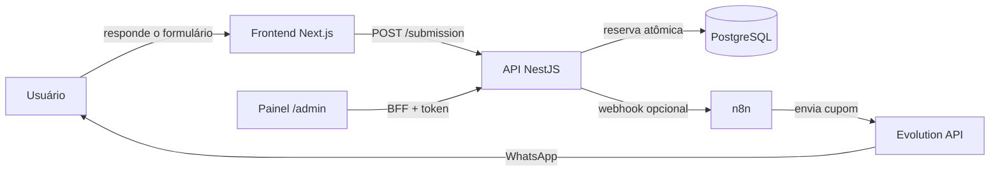

# 🎟️ CupomForm

**MVP de formulário de campanha com emissão automática de cupom único por WhatsApp.**

Coleta respostas, reserva um cupom único por número de telefone e permite o envio opcional via Evolution API, orquestrado no n8n.

<p align="left">
  
  
  
  
  
  
  
</p>

---

## 📚 Sumário

- [Stack](#-stack)
- [Como funciona](#-como-funciona)
- [Executar localmente](#-executar-localmente)
- [Importar cupons reais](#-importar-cupons-reais)
- [Deploy no Coolify](#-deploy-no-coolify)
- [Segurança e escopo](#-segurança-e-escopo)
- [Harness de IA com Codex e Gemini](#-harness-de-ia-com-codex-e-gemini)
- [Sprints e entregas](#-sprints-e-entregas)

---

## 🧱 Stack

| Camada | Tecnologia |
| --- | --- |
| Frontend | Next.js 15 · React 19 · Tailwind CSS 4 |
| API | NestJS 11 · Prisma 6 · class-validator |
| Banco de dados | PostgreSQL 16 |
| Orquestração de envio | n8n · Evolution API · Google Sheets |
| Infra | Docker Compose (local) · Coolify (homologação/produção) |

## 🔄 Como funciona



1. O usuário responde às perguntas da campanha no frontend.
2. A API valida o payload, normaliza o telefone brasileiro e reserva **um único cupom por número** de forma transacional.
3. Opcionalmente, a API notifica o n8n, que dispara o envio via Evolution API e registra o resultado em uma planilha do Google Sheets.
4. O painel `/admin` permite acompanhar respostas, cupons e auditoria por trás de sessão autenticada.

## 🚀 Executar localmente

1. Copie `.env.example` para `.env` e troque todos os segredos.
2. Suba a infraestrutura:

   ```bash
   docker compose up --build
   ```

3. No primeiro uso, aplique a migração e os dados de exemplo dentro do serviço de API:

   ```bash
   docker compose exec api npm run prisma:seed -w @cupomform/backend
   ```

   > A migração é aplicada automaticamente na inicialização da API. O seed cria a campanha `gente-daqui`, suas 12 perguntas e três cupons `GENTE-DEV-*` de homologação.

4. Acesse os serviços:

   | Serviço | URL |
   | --- | --- |
   | Formulário | http://localhost:3000 |
   | Painel administrativo | http://localhost:3000/admin |
   | n8n | http://localhost:5678 |
   | Health check da API | http://localhost:3001/api/health |
   | Documentação da API (Swagger) | http://localhost:3001/api/docs |

   A documentação interativa expõe também o OpenAPI JSON em `/api/docs-json`. Defina `SWAGGER_ENABLED=false` para ocultá-la em um ambiente público.

> 💡 **Modo preview**: para navegar pelo formulário completo sem iniciar API, PostgreSQL ou n8n, abra `http://localhost:3000/?preview=1`. É explicitamente local — usa dados demonstrativos, entrega o código `GENTE10` e não persiste nem envia WhatsApp.

## 📥 Importar cupons reais

Para importar o lote real (CSV com uma coluna `code`, exportado do Google Sheets):

```bash
COUPON_CSV_PATH=/caminho/cupons.csv npm run db:import-coupons
```

No PowerShell:

```powershell
$env:COUPON_CSV_PATH='C:\caminho\cupons.csv'; npm run db:import-coupons
```

## ☁️ Deploy no Coolify

**Estado de homologação em 01/08/2026:**

| Item | Status | URL |
| --- | --- | --- |
| Frontend | ✅ Publicado | https://cupom.r0b14.com |
| API | ✅ Publicado | https://api-cupom.r0b14.com |
| Health check | ✅ Saudável | https://api-cupom.r0b14.com/api/health |
| Swagger | ✅ Disponível | https://api-cupom.r0b14.com/api/docs |
| PostgreSQL 16 / painel admin | ✅ Publicados e saudáveis | — |
| n8n / Evolution API / Google Sheets | ⏳ Pendente | — |

### Passo a passo

1. Crie um PostgreSQL persistente no Coolify e configure `DATABASE_URL` na API.
2. Crie dois serviços a partir deste repositório: **API** usando `backend/Dockerfile` e **Web** usando `frontend/Dockerfile`; defina seus domínios HTTPS.
3. Defina `FRONTEND_URL` na API e construa a Web com `NEXT_PUBLIC_API_URL=https://api.seudominio.com/api`.
4. No frontend, mantenha `ADMIN_API_URL`, `ADMIN_API_TOKEN`, `ADMIN_PANEL_PASSWORD` e `ADMIN_SESSION_SECRET` somente no runtime. **Nunca** use `NEXT_PUBLIC_` para esses valores.
5. No Next standalone, configure `HOSTNAME=0.0.0.0` e `PORT=3000` em runtime. Use `127.0.0.1`, não `localhost`, nos health checks internos.
6. Hospede o n8n como serviço separado, com volume persistente, `N8N_ENCRYPTION_KEY` e `WEBHOOK_URL` públicos. Configure `N8N_DELIVERY_WEBHOOK_URL` na API com a URL do webhook do n8n.
7. Use segredos longos e distintos para `N8N_SHARED_SECRET` e `INTERNAL_CALLBACK_SECRET`.
8. Importe o fluxo descrito em [n8n/README.md](n8n/README.md), conecte a Evolution API e o Google Sheets, e faça um envio de teste antes de divulgar o QR.

## 🔐 Segurança e escopo

- Validação de payload, normalização de telefone brasileiro, CORS restrito, rate limit, reserva transacional e endpoints internos protegidos por segredo.
- O painel `/admin` usa um BFF Next.js, sessão em cookie `HttpOnly` e token Bearer disponível somente no servidor. Operações administrativas relevantes geram auditoria no PostgreSQL.
- Um telefone recebe somente **um cupom por campanha**; novos envios mostram o código originalmente emitido.
- A confirmação da Evolution significa solicitação/entrega ao provedor, **não** prova de titularidade do número — isso exigiria OTP, fora do escopo deste MVP.
- Não há geração de QR code nem construtor visual de formulário nesta versão.

## 🤖 Harness de IA com Codex e Gemini

O projeto inclui um roteador local de tarefas em [ai/routing.json](ai/routing.json). A meta é gastar pouco sem usar um modelo fraco para mudanças críticas:

| Atividade | Agente padrão | Modo |
| --- | --- | --- |
| Explorar repositório, resumir logs/docs, planejar testes | Gemini | somente leitura |
| Revisar um diff como segunda opinião | Gemini | somente leitura |
| Implementar backend, depurar e rodar verificações | Codex | escrita no workspace |
| Implementar toda a interface em `frontend/` | Gemini | escrita no workspace |
| Arquitetura e análise de segurança | Codex | somente leitura |

1. O arquivo versionado `ai/models.example.json` já é a configuração ativa quando não existe `ai/models.local.json`: Gemini 3.5 executa leitura/revisão, Gemini 3.6 implementa o frontend, Codex Terra executa backend e Codex Sol fica restrito a arquitetura/segurança. Para substituir algum ID disponível na sua conta sem alterar o Git, copie-o para `ai/models.local.json` e altere somente o campo necessário.

2. Faça uma prévia gratuita da rota:

   ```powershell
   .\scripts\ai-harness.ps1 -Task explore -Prompt 'Mapeie o fluxo de emissão de cupom'
   ```

3. Só execute depois de conferir a prévia:

   ```powershell
   .\scripts\ai-harness.ps1 -Task explore -Prompt 'Mapeie o fluxo de emissão de cupom' -Run
   .\scripts\ai-harness.ps1 -Task implement -Prompt 'Adicione validação X e execute os testes' -Run
   .\scripts\ai-harness.ps1 -Task frontend-implement -Prompt 'Implemente a tela a partir do design aprovado' -Run
   ```

Rode Codex e Gemini separadamente, sempre nessa ordem: Codex entrega backend/contratos; Gemini entrega somente `frontend/`. O procedimento completo está em [ai/SEQUENTIAL_WORKFLOW.md](ai/SEQUENTIAL_WORKFLOW.md). Use `frontend-design` para preparar o briefing no Stitch ou Claude Design e `frontend-implement` para o Gemini implementar a interface conforme [frontend/FRONTEND_PROMPT.md](frontend/FRONTEND_PROMPT.md). Use `review` depois de uma implementação importante e `security` antes de alterações em autenticação, LGPD, pagamentos ou integração com a Evolution API. As regras compartilhadas estão em [AGENTS.md](AGENTS.md); o script as inclui no prompt dos dois CLIs.

## 🗂️ Sprints e entregas

O processo completo de implementação fica em [ai/sprints/README.md](ai/sprints/README.md): backlog priorizado, sprints 00–03, checklist de entrega, templates e handoff Codex→Gemini. Para abrir uma próxima sprint:

```powershell
.\scripts\new-sprint.ps1 -Id '04' -Title 'Novo fluxo de campanha'
```

---

<p align="center"><sub>Licenciado sob <a href="LICENSE">MIT</a> · © 2026 Robson Thiago</sub></p>
